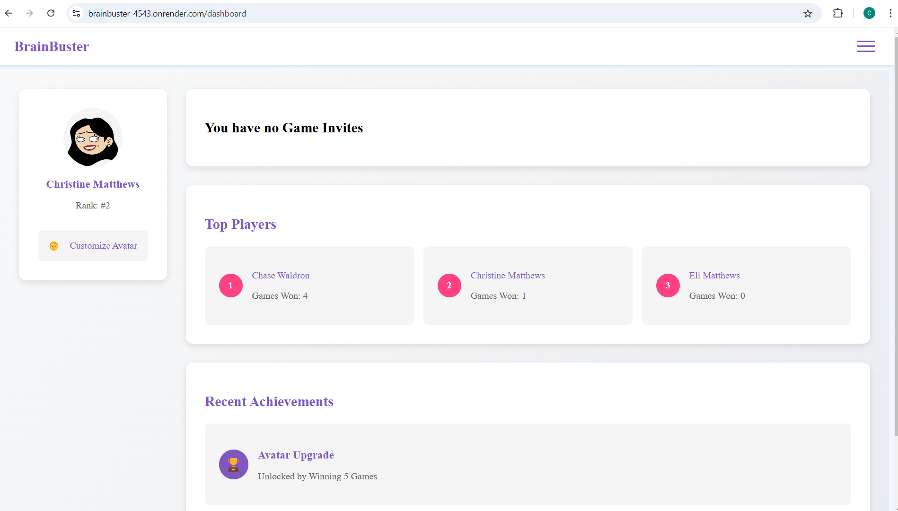
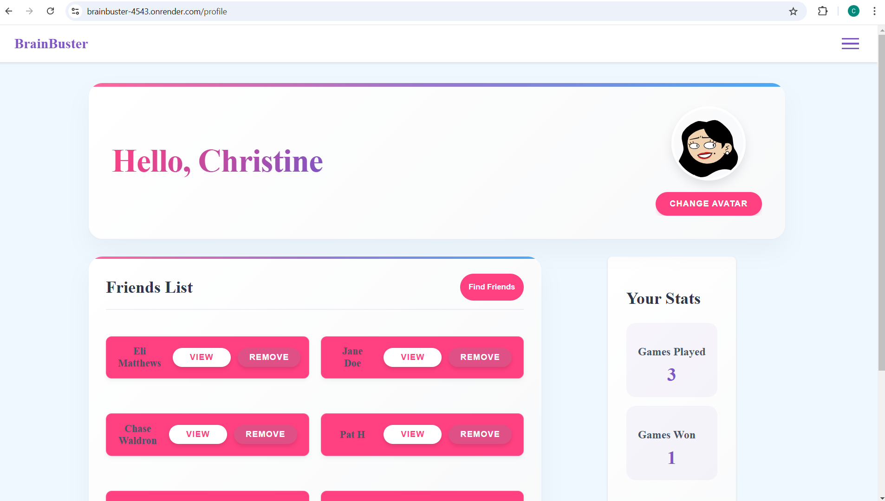

# BrainBuster

## Table of Contents
- [Description](#description)
- [Installation](#installation)
- [Usage](#usage)
- [Licenses](#licenses)
- [Contributors](#contributors)
- [Testing](#testing)
- [Contact](#contact-info-for-questions)
- [Screenshots](#screenshots)
- [Website](#live-website)

## Description
This application is a multiplayer trivia game where players can compete friends friends, win points, and see where they rank in the overall game. It was created to example our skills in full-stack mern applications using queries, mutations, socket.io, and multiplayer functionality!

## Installation
n/a

## Usage
To use this app, create an account and avatar with your account. Send friend requests and add friends to your friends list. Invite friends to a game and play to win points!

## Licenses
#### MIT License
The MIT License is an older license used to provide copyright protection.

## Contributors
Patrick Hennessey, Chase Waldron, Christine Matthews, and Brianna Pirro

## Testing
n/a

## Contact info for Questions
#### Github: 
<a href="https://github.com/cmatthews3212">cmatthews3212</a>
https://github.com/RickHennessey87
https://github.com/CatMamaGB
https://github.com/chasewaldron2400

## Screenshots

## Live Website
https://brainbuster-4543.onrender.com/